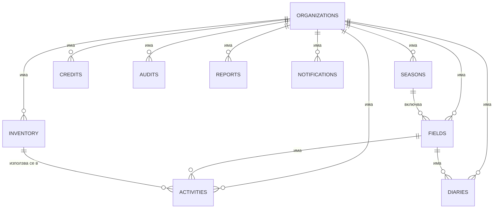
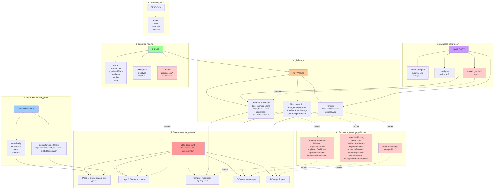
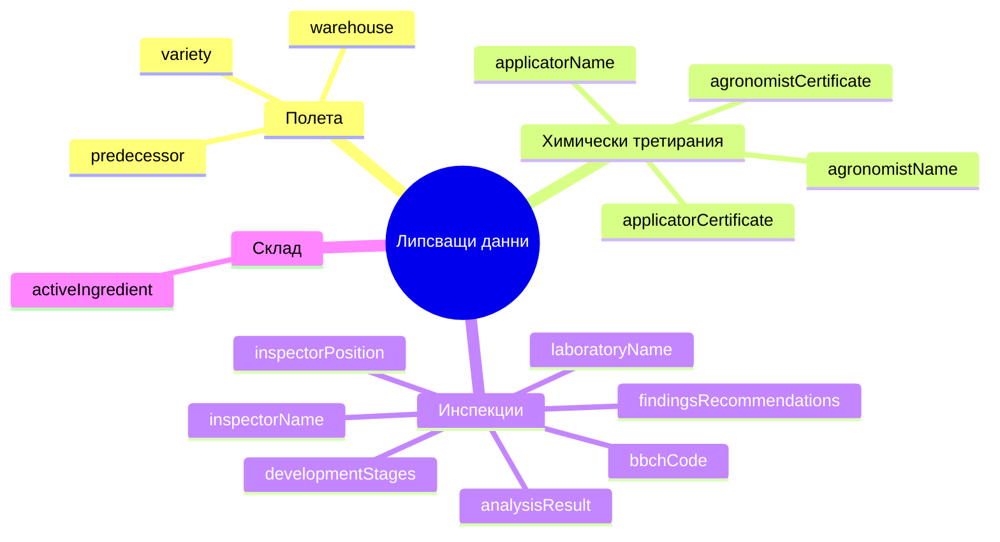

# Схема на данните в Agro Ops Platform

Този документ описва структурата на данните в приложението и връзките между тях, за да се види какво липсва в документите.

## ER диаграма на данните



## Обща структура на данните

```
┌─────────────────────────────────────────────────────────────────┐
│                      ORGANIZATIONS                              │
│  (Организации/Ферми)                                            │
│  ────────────────────────────────────────────────────────────  │
│  • clerkOrgId (string)                                          │
│  • name (string) - Име на организацията                         │
│  • slug (string)                                                │
│  • municipality (optional) - Община                              │
│  • settlement (optional) - Населено място                        │
│  • address (optional) - Адрес                                    │
│  • agricultureDirectorate (optional) - Дирекция "Земеделие"     │
│  • regionalFoodSafetyDirectorate (optional) - ОДБХ              │
│  • ekatteRegistration (optional) - ЕКАТТЕ (5 цифри)            │
│  • isOnboarded (optional)                                       │
│  • createdAt, updatedAt                                         │
└─────────────────────────────────────────────────────────────────┘
                              │
                              │ 1:N
                              │
        ┌─────────────────────┼─────────────────────┐
        │                     │                     │
        ▼                     ▼                     ▼
┌──────────────┐    ┌──────────────┐    ┌──────────────┐
│   SEASONS    │    │    FIELDS    │    │  INVENTORY   │
│  (Сезони)    │    │   (Полета)   │    │  (Склад)     │
└──────────────┘    └──────────────┘    └──────────────┘
        │                     │                     │
        │                     │                     │
        │ 1:N                │ 1:N                 │ 1:N
        │                     │                     │
        ▼                     ▼                     ▼
┌──────────────┐    ┌──────────────┐    ┌──────────────┐
│  ACTIVITIES  │    │   DIARIES    │    │   CREDITS    │
│ (Дейности)   │    │  (Дневници)  │    │ (Финанси)    │
└──────────────┘    └──────────────┘    └──────────────┘
        │
        │ N:1
        │
        ▼
┌──────────────┐
│  INVENTORY   │
│  (Склад)     │
└──────────────┘
```

## Детайлна схема на таблиците

### 1. ORGANIZATIONS (Организации)

**Описание:** Основните организации/ферми в системата

**Полета:**
- `clerkOrgId` (string) - ID от Clerk
- `name` (string) - Име на организацията
- `slug` (string) - URL slug
- `municipality` (optional) - Община
- `settlement` (optional) - Населено място
- `address` (optional) - Адрес
- `agricultureDirectorate` (optional) - Областна дирекция "Земеделие"
- `regionalFoodSafetyDirectorate` (optional) - ОДБХ
- `ekatteRegistration` (optional) - ЕКАТТЕ на регистрация (5 цифри)
- `isOnboarded` (optional) - Дали е завършен onboarding
- `createdAt`, `updatedAt` - Timestamps

**Индекси:**
- `by_clerk_org_id` - за търсене по Clerk ID
- `by_slug` - за търсене по slug

---

### 2. SEASONS (Сезони)

**Описание:** Сезони/кампании за земеделска дейност

**Полета:**
- `organizationId` (id → organizations) - **FK към organizations**
- `name` (string) - Име на сезона (напр. "2024 / 2025")
- `year` (string) - Годинен идентификатор
- `startDate` (number) - Начална дата (timestamp)
- `endDate` (number) - Крайна дата (timestamp)
- `isActive` (boolean) - Дали е активен сезон
- `createdAt`, `updatedAt` - Timestamps

**Индекси:**
- `by_organization` - за търсене по организация
- `by_active` - за активни сезони
- `by_year` - за търсене по година

**Връзки:**
- N:1 с `organizations`
- 1:N с `fields` (чрез `field.seasonId`)

---

### 3. FIELDS (Полета)

**Описание:** Земеделски полета/парцели

**Полета:**
- `organizationId` (id → organizations) - **FK към organizations**
- `name` (string) - Име на полето
- `bzsNumber` (string) - Номер по БЗС (формат "00000-000")
- `populatedPlace` (string) - Населено място
- `landArea` (string) - Землище
- `locality` (string) - Местност
- `area` (number) - Площ в декари (дка)
- `sowingDate` (optional) - Дата на засяване (timestamp)
- `cropType` (optional) - Култура
- `location` (optional) - GPS координати
  - `latitude` (number)
  - `longitude` (number)
- `seasonId` (optional, id → seasons) - **FK към seasons**
- `createdAt`, `updatedAt` - Timestamps

**Индекси:**
- `by_organization` - за търсене по организация
- `by_season` - за търсене по сезон

**Връзки:**
- N:1 с `organizations`
- N:1 с `seasons` (опционално)
- 1:N с `activities` (чрез `activity.fieldId`)
- 1:N с `diaries` (чрез `diary.fieldId`)

---

### 4. ACTIVITIES (Дейности)

**Описание:** Земеделски дейности (третирания, торене, инспекции и др.)

**Полета:**
- `organizationId` (id → organizations) - **FK към organizations**
- `fieldId` (optional, id → fields) - **FK към fields**
- `type` (string) - Тип дейност (за обратна съвместимост)
- `category` (union) - Категория:
  - `"chemical_treatment"` - Химическо третиране
  - `"field_inspection"` - Инспекция на поле
  - `"fertilizer"` - Торене
  - `"farm_activity"` - Фермерска дейност
- `description` (optional) - Описание
- `date` (number) - Дата на дейността (timestamp)
- `userId` (string) - Clerk user ID на извършителя

**Полета за Chemical Treatment:**
- `chemicalId` (optional, id → inventory) - **FK към inventory**
- `chemicalName` (optional) - Име на химикала
- `infestationType` (optional) - Вид нараждане
- `dose` (optional) - Доза (л/дка)
- `quarantinePeriod` (optional) - Карантинен срок (дни, 0 = няма)
- `treatedArea` (optional) - Третирана площ (дка)
- `equipment` (optional) - Оборудване

**Полета за Field Inspection:**
- `startDate` (optional) - Начална дата (timestamp)
- `surveyedArea` (optional) - Обследвана площ (дка)
- `attackedArea` (optional) - Нападната площ (дка)
- `damage` (optional) - Увреждане
- `damageType` (optional) - Тип увреждане
- `attackDensity` (optional) - Плътност/степен на нападение
- `phenologicalPhase` (optional) - Феноложка фаза

**Полета за Fertilizer:**
- `fertilizerId` (optional, id → inventory) - **FK към inventory**
- `fertilizerName` (optional) - Име на торове
- `fertilizedArea` (optional) - Торена площ (дка)
- `fertilizerType` (optional) - Тип торове

**Полета за Farm Activity:**
- `endDate` (optional) - Крайна дата (timestamp)
- `activityType` (optional) - Тип дейност
- `materialType` (optional) - Тип материал (семена, торове, ППЗ)
- `quantity` (optional) - Количество (напр. "10 kg/dka")

**Общи полета:**
- `inventoryItemId` (optional, id → inventory) - **FK към inventory** (общо)
- `metadata` (optional) - За обратна съвместимост
- `createdAt`, `updatedAt` - Timestamps

**Индекси:**
- `by_organization` - за търсене по организация
- `by_field` - за търсене по поле
- `by_date` - за търсене по дата
- `by_category` - за търсене по категория

**Връзки:**
- N:1 с `organizations`
- N:1 с `fields` (опционално)
- N:1 с `inventory` (опционално, за химикали/торове)

---

### 5. INVENTORY (Склад)

**Описание:** Складова наличност (химикали, торове, семена, оборудване)

**Полета:**
- `organizationId` (id → organizations) - **FK към organizations**
- `name` (string) - Име на продукта
- `category` (string) - Категория:
  - `"seeds"` - Семена
  - `"fertilizer"` - Торове
  - `"equipment"` - Оборудване
  - `"chemical"` - Химикали
  - `"pesticide"` - Пестициди
  - `"soil_conditioner"` - Почвоусъвършенстващи средства
- `quantity` (number) - Количество
- `unit` (string) - Мерна единица (кг, литри, броя и др.)
- `location` (optional) - Местоположение в склада
- `expiryDate` (optional) - Срок на годност (timestamp)
- `cropTypes` (optional, array) - Приложими култури
- `applicableFor` (optional, array) - За какви дейности може да се използва

**Полета специфични за торове:**
- `contents` (optional) - Съдържание (текст)
- `nitrogenContent` (optional) - Съдържание на азот (%)
- `fertilizerType` (optional) - Тип торове ("гранулиран" или "листен")

- `createdAt`, `updatedAt` - Timestamps

**Индекси:**
- `by_organization` - за търсене по организация
- `by_category` - за търсене по категория

**Връзки:**
- N:1 с `organizations`
- 1:N с `activities` (чрез `activity.chemicalId`, `activity.fertilizerId`, `activity.inventoryItemId`)

---

### 6. DIARIES (Дневници)

**Описание:** Дневници/бележки за полета или общи

**Полета:**
- `organizationId` (id → organizations) - **FK към organizations**
- `fieldId` (optional, id → fields) - **FK към fields**
- `title` (string) - Заглавие
- `content` (string) - Съдържание
- `date` (number) - Дата (timestamp)
- `userId` (string) - Clerk user ID на автора
- `tags` (optional, array) - Тагове
- `createdAt`, `updatedAt` - Timestamps

**Индекси:**
- `by_organization` - за търсене по организация
- `by_field` - за търсене по поле
- `by_date` - за търсене по дата

**Връзки:**
- N:1 с `organizations`
- N:1 с `fields` (опционално)

---

### 7. CREDITS (Финанси)

**Описание:** Финансови записи (приходи/разходи)

**Полета:**
- `organizationId` (id → organizations) - **FK към organizations**
- `amount` (number) - Сума
- `currency` (string) - Валута (BGN, EUR, USD и др.)
- `type` (string) - Тип: `"income"` или `"expense"`
- `category` (optional) - Категория
- `description` (string) - Описание
- `date` (number) - Дата (timestamp)
- `userId` (string) - Clerk user ID на създателя
- `createdAt`, `updatedAt` - Timestamps

**Индекси:**
- `by_organization` - за търсене по организация
- `by_date` - за търсене по дата
- `by_type` - за търсене по тип

**Връзки:**
- N:1 с `organizations`

---

### 8. AUDITS (Одити)

**Описание:** Одити за съответствие, качество, безопасност

**Полета:**
- `organizationId` (id → organizations) - **FK към organizations**
- `type` (string) - Тип одит (compliance, quality, safety)
- `title` (string) - Заглавие
- `description` (string) - Описание
- `status` (string) - Статус: `"pending"`, `"completed"`, `"failed"`
- `date` (number) - Дата (timestamp)
- `userId` (string) - Clerk user ID на създателя
- `findings` (optional, array) - Намерения
- `createdAt`, `updatedAt` - Timestamps

**Индекси:**
- `by_organization` - за търсене по организация
- `by_status` - за търсене по статус
- `by_date` - за търсене по дата

**Връзки:**
- N:1 с `organizations`

---

### 9. REPORTS (Доклади)

**Описание:** Генерирани доклади

**Полета:**
- `organizationId` (id → organizations) - **FK към organizations**
- `type` (string) - Тип доклад
- `title` (string) - Заглавие
- `content` (any) - Съдържание (гъвкава структура)
- `generatedAt` (number) - Дата на генериране (timestamp)
- `generatedBy` (string) - Clerk user ID на генериралия
- `createdAt` - Timestamp

**Индекси:**
- `by_organization` - за търсене по организация
- `by_type` - за търсене по тип

**Връзки:**
- N:1 с `organizations`

---

### 10. NOTIFICATIONS (Известия)

**Описание:** Потребителски известия

**Полета:**
- `organizationId` (id → organizations) - **FK към organizations**
- `userId` (string) - Clerk user ID на получателя
- `title` (string) - Заглавие
- `message` (string) - Съобщение
- `type` (string) - Тип: `"info"`, `"warning"`, `"error"`
- `read` (boolean) - Дали е прочетено
- `createdAt` - Timestamp

**Индекси:**
- `by_organization` - за търсене по организация
- `by_user` - за търсене по потребител
- `by_read` - за търсене по статус на прочитане

**Връзки:**
- N:1 с `organizations`

---

## Поток на данните за LRD документ (Дневник за проведени РЗ мероприятия и торене)



## Липсващи данни в документите (BABH)

Според анализа на `babhDocument.ts`, следните данни **липсват** в базата данни и се попълват като празни стойности в документа:

### Визуализация на липсващите данни



### Липсващи данни за полетата:

1. **`variety`** - Сорт/хибрид на културата
   - *Къде трябва да е:* `fields` таблица
   - *Предложение:* Добави поле `variety` (optional string) в `fields`

2. **`predecessor`** - Предшественик (предишна култура)
   - *Къде трябва да е:* `fields` таблица
   - *Предложение:* Добави поле `predecessor` (optional string) в `fields`

3. **`warehouse`** - Склад/складова база
   - *Къде трябва да е:* `fields` таблица или `organizations`
   - *Предложение:* Добави поле `warehouse` (optional string) в `fields` или `organizations`

4. **`cadastral_number`** - Кадастрален номер
   - *Забележка:* В момента се използва `bzsNumber`, но може да е различно поле

### Липсващи данни за инспекции:

5. **`bbch_code`** - BBCH код (феноложка фаза)
   - *Къде трябва да е:* `activities` таблица (за `field_inspection`)
   - *Предложение:* Добави поле `bbchCode` (optional string) в `activities`

6. **`development_stages`** - Стадии на развитие
   - *Къде трябва да е:* `activities` таблица (за `field_inspection`)
   - *Предложение:* Добави поле `developmentStages` (optional string) в `activities`

### Липсващи данни за химически третирания:

7. **`applicator_name`** - Име на приложителя
   - *Къде трябва да е:* `activities` таблица (за `chemical_treatment`)
   - *Предложение:* Добави поле `applicatorName` (optional string) в `activities`

8. **`applicator_certificate`** - Сертификат на приложителя
   - *Къде трябва да е:* `activities` таблица (за `chemical_treatment`)
   - *Предложение:* Добави поле `applicatorCertificate` (optional string) в `activities`

9. **`agronomist_name`** - Име на агронома
   - *Къде трябва да е:* `activities` таблица (за `chemical_treatment`)
   - *Предложение:* Добави поле `agronomistName` (optional string) в `activities`

10. **`agronomist_certificate`** - Сертификат на агронома
    - *Къде трябва да е:* `activities` таблица (за `chemical_treatment`)
    - *Предложение:* Добави поле `agronomistCertificate` (optional string) в `activities`

11. **`active_ingredient`** - Активна съставка
    - *Къде трябва да е:* `inventory` таблица (за химикали)
    - *Предложение:* Добави поле `activeIngredient` (optional string) в `inventory`

### Липсващи данни за торове:

12. **`composition`** - Състав на торовете
    - *Забележка:* В момента има `contents` в `inventory`, но може да е по-структурирано
    - *Предложение:* Разшири `contents` или добави `composition` (optional string) в `inventory`

### Липсващи данни за инспекции (общи):

13. **`inspector_name`** - Име на инспектора
    - *Къде трябва да е:* `activities` таблица (за `field_inspection`)
    - *Предложение:* Добави поле `inspectorName` (optional string) в `activities`

14. **`inspector_position`** - Длъжност на инспектора
    - *Къде трябва да е:* `activities` таблица (за `field_inspection`)
    - *Предложение:* Добави поле `inspectorPosition` (optional string) в `activities`

15. **`laboratory_name`** - Име на лаборатория
    - *Къде трябва да е:* `activities` таблица (за `field_inspection`) или `organizations`
    - *Предложение:* Добави поле `laboratoryName` (optional string) в `activities` или `organizations`

16. **`analysis_result`** - Резултат от анализ
    - *Къде трябва да е:* `activities` таблица (за `field_inspection`)
    - *Предложение:* Добави поле `analysisResult` (optional string) в `activities`

17. **`findings_recommendations`** - Намерения и препоръки
    - *Къде трябва да е:* `activities` таблица (за `field_inspection`)
    - *Предложение:* Добави поле `findingsRecommendations` (optional string) в `activities`

---

## Резюме на липсващите данни

### По категории:

**За полета (`fields`):**
- `variety` - Сорт/хибрид
- `predecessor` - Предшественик
- `warehouse` - Склад

**За дейности - химически третирания (`activities`):**
- `applicatorName` - Име на приложителя
- `applicatorCertificate` - Сертификат на приложителя
- `agronomistName` - Име на агронома
- `agronomistCertificate` - Сертификат на агронома

**За дейности - инспекции (`activities`):**
- `bbchCode` - BBCH код
- `developmentStages` - Стадии на развитие
- `inspectorName` - Име на инспектора
- `inspectorPosition` - Длъжност на инспектора
- `laboratoryName` - Име на лаборатория
- `analysisResult` - Резултат от анализ
- `findingsRecommendations` - Намерения и препоръки

**За склад (`inventory`):**
- `activeIngredient` - Активна съставка (за химикали)

**За организации (`organizations`):**
- `warehouse` - Склад (ако е общ за организацията)
- `laboratoryName` - Лаборатория (ако е обща за организацията)

---

## Препоръки за попълване

1. **Приоритет 1 (критични за документите):**
   - Добави полета за приложители и агрономи в `activities`
   - Добави `variety` и `predecessor` в `fields`
   - Добави `bbchCode` в `activities` за инспекции

2. **Приоритет 2 (важни за пълнота):**
   - Добави данни за инспектори в `activities`
   - Добави `activeIngredient` в `inventory` за химикали
   - Добави `warehouse` в `fields` или `organizations`

3. **Приоритет 3 (допълнителни):**
   - Добави `laboratoryName` и `analysisResult` в `activities`
   - Добави `findingsRecommendations` в `activities`

---

## ER диаграма (текстов формат)

```
ORGANIZATIONS (1) ──< (N) SEASONS
ORGANIZATIONS (1) ──< (N) FIELDS
ORGANIZATIONS (1) ──< (N) ACTIVITIES
ORGANIZATIONS (1) ──< (N) INVENTORY
ORGANIZATIONS (1) ──< (N) DIARIES
ORGANIZATIONS (1) ──< (N) CREDITS
ORGANIZATIONS (1) ──< (N) AUDITS
ORGANIZATIONS (1) ──< (N) REPORTS
ORGANIZATIONS (1) ──< (N) NOTIFICATIONS

SEASONS (1) ──< (N) FIELDS [seasonId]

FIELDS (1) ──< (N) ACTIVITIES [fieldId]
FIELDS (1) ──< (N) DIARIES [fieldId]

INVENTORY (1) ──< (N) ACTIVITIES [chemicalId/fertilizerId/inventoryItemId]
```

---

## Таблица на липсващите данни за LRD файл (Дневник за проведени РЗ мероприятия и торене)

Таблицата по-долу показва всички данни, които **липсват** в базата данни и са необходими за пълното генериране на LRD документ. Данните в момента се попълват като празни стойности в документа.

| № | Поле | Таблица | Категория | Приоритет | Описание | Къде се използва в документа |
|---|------|---------|-----------|-----------|----------|------------------------------|
| 1 | `variety` | `fields` | Поле | 🔴 Висок | Сорт/хибрид на културата | Страница 2 - Данни за полето |
| 2 | `predecessor` | `fields` | Поле | 🔴 Висок | Предшественик (предишна култура) | Страница 2 - Данни за полето |
| 3 | `warehouse` | `fields` или `organizations` | Поле/Организация | 🟡 Среден | Склад/складова база | Страница 2 - Данни за полето |
| 4 | `bbch_code` | `activities` | Инспекция | 🔴 Висок | BBCH код за феноложка фаза | Таблица - Инспекции |
| 5 | `development_stages` | `activities` | Инспекция | 🟡 Среден | Стадии на развитие на вредителите | Таблица - Инспекции |
| 6 | `applicator_name` | `activities` | Химическо третиране | 🔴 Висок | Име на приложителя на химикала | Таблица - Химически третирания |
| 7 | `applicator_certificate` | `activities` | Химическо третиране | 🔴 Висок | Сертификат/лиценз на приложителя | Таблица - Химически третирания |
| 8 | `agronomist_name` | `activities` | Химическо третиране | 🔴 Висок | Име на агронома, който предписва третирането | Таблица - Химически третирания |
| 9 | `agronomist_certificate` | `activities` | Химическо третиране | 🔴 Висок | Сертификат/лиценз на агронома | Таблица - Химически третирания |
| 10 | `inspector_name` | `activities` | Инспекция | 🟡 Среден | Име на инспектора, който извършва обследването | Таблица - Инспекции |
| 11 | `inspector_position` | `activities` | Инспекция | 🟡 Среден | Длъжност на инспектора | Таблица - Инспекции |
| 12 | `laboratory_name` | `activities` или `organizations` | Инспекция | 🟢 Нисък | Име на лаборатория (ако се извършват анализи) | Таблица - Инспекции |
| 13 | `analysis_result` | `activities` | Инспекция | 🟢 Нисък | Резултат от лабораторен анализ | Таблица - Инспекции |
| 14 | `findings_recommendations` | `activities` | Инспекция | 🟢 Нисък | Намерения и препоръки от инспекцията | Таблица - Инспекции |
| 15 | `active_ingredient` | `inventory` | Склад | 🟡 Среден | Активна съставка на химикала | Таблица - Химически третирания (чрез inventory) |
| 16 | `composition` | `activities` или `inventory` | Торене | 🟡 Среден | Състав на торовете (NPK и др.) | Таблица - Торене |

### Легенда за приоритетите:
- 🔴 **Висок** - Критични данни, необходими за валидност на документа
- 🟡 **Среден** - Важни данни за пълнота и съответствие
- 🟢 **Нисък** - Допълнителни данни, полезни но не критични

### Препоръки за имплементация:

**Фаза 1 (Критични - Приоритет 🔴):**
1. Добави в `fields` таблицата:
   ```typescript
   variety: v.optional(v.string()),
   predecessor: v.optional(v.string()),
   ```

2. Добави в `activities` таблицата (за `chemical_treatment`):
   ```typescript
   applicatorName: v.optional(v.string()),
   applicatorCertificate: v.optional(v.string()),
   agronomistName: v.optional(v.string()),
   agronomistCertificate: v.optional(v.string()),
   ```

3. Добави в `activities` таблицата (за `field_inspection`):
   ```typescript
   bbchCode: v.optional(v.string()),
   ```

**Фаза 2 (Важни - Приоритет 🟡):**
4. Добави в `activities` таблицата (за `field_inspection`):
   ```typescript
   developmentStages: v.optional(v.string()),
   inspectorName: v.optional(v.string()),
   inspectorPosition: v.optional(v.string()),
   ```

5. Добави в `inventory` таблицата (за `chemical` категория):
   ```typescript
   activeIngredient: v.optional(v.string()),
   ```

6. Добави в `activities` таблицата (за `fertilizer`):
   ```typescript
   composition: v.optional(v.string()),
   ```
   Или в `inventory` таблицата (за `fertilizer` категория).

7. Добави в `fields` или `organizations`:
   ```typescript
   warehouse: v.optional(v.string()),
   ```

**Фаза 3 (Допълнителни - Приоритет 🟢):**
8. Добави в `activities` таблицата (за `field_inspection`):
   ```typescript
   laboratoryName: v.optional(v.string()),
   analysisResult: v.optional(v.string()),
   findingsRecommendations: v.optional(v.string()),
   ```

---

*Последна актуализация: Генерирано от анализ на schema.ts и babhDocument.ts*

