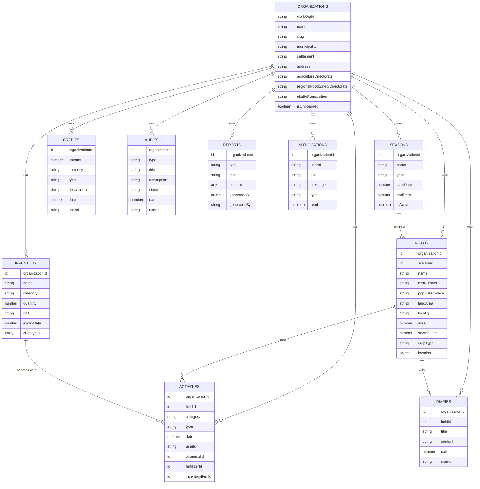
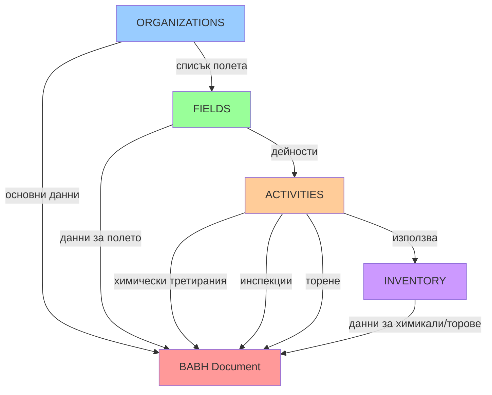
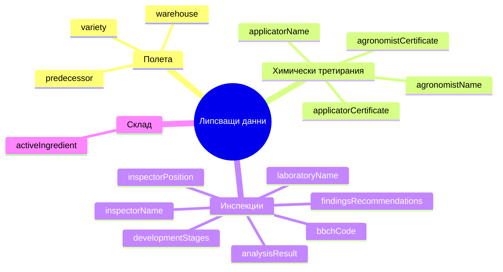

# Визуална схема на данните - Agro Ops Platform

## ER диаграма (Mermaid)



## Поток на данните за BABH документ



## Липсващи данни - визуализация



## Структура на данните по категории

### 1. Организационни данни
```
ORGANIZATIONS
├── Основни данни (name, slug, clerkOrgId)
├── Адресни данни (municipality, settlement, address)
└── Регистрационни данни (ekatteRegistration, agricultureDirectorate, regionalFoodSafetyDirectorate)
```

### 2. Производствени данни
```
SEASONS
└── FIELDS
    ├── Основни данни (name, bzsNumber, area, cropType)
    ├── Местоположение (populatedPlace, landArea, locality, location)
    ├── Производствени данни (sowingDate, variety*, predecessor*)
    └── ACTIVITIES
        ├── Chemical Treatment
        │   ├── Химикал (chemicalId, chemicalName, dose, treatedArea)
        │   ├── Нараждане (infestationType)
        │   ├── Оборудване (equipment)
        │   ├── Карантин (quarantinePeriod)
        │   └── Липсващи: applicatorName*, applicatorCertificate*, agronomistName*, agronomistCertificate*
        ├── Field Inspection
        │   ├── Обследване (surveyedArea, attackedArea)
        │   ├── Увреждане (damage, damageType, attackDensity)
        │   ├── Фаза (phenologicalPhase)
        │   └── Липсващи: bbchCode*, developmentStages*, inspectorName*, inspectorPosition*, laboratoryName*, analysisResult*, findingsRecommendations*
        ├── Fertilizer
        │   ├── Торове (fertilizerId, fertilizerName, fertilizedArea)
        │   └── Тип (fertilizerType)
        └── Farm Activity
            ├── Тип (activityType)
            ├── Материал (materialType, quantity)
            └── Дати (date, endDate)
```

### 3. Складова наличност
```
INVENTORY
├── Основни данни (name, category, quantity, unit)
├── Местоположение (location, expiryDate)
├── Приложимост (cropTypes, applicableFor)
├── Торове специфични (contents, nitrogenContent, fertilizerType)
└── Липсващи: activeIngredient* (за химикали)
```

### 4. Допълнителни данни
```
DIARIES (бележки)
CREDITS (финанси)
AUDITS (одити)
REPORTS (доклади)
NOTIFICATIONS (известия)
```

*Липсващите данни са маркирани с `*`

## Таблица на липсващите данни

| Данни | Таблица | Категория | Приоритет | Забележка |
|-------|---------|-----------|-----------|-----------|
| `variety` | `fields` | Поле | Висок | Сорт/хибрид на културата |
| `predecessor` | `fields` | Поле | Висок | Предшественик (предишна култура) |
| `warehouse` | `fields` или `organizations` | Поле/Организация | Среден | Склад/складова база |
| `bbchCode` | `activities` | Инспекция | Висок | BBCH код за феноложка фаза |
| `developmentStages` | `activities` | Инспекция | Среден | Стадии на развитие |
| `applicatorName` | `activities` | Химическо третиране | Висок | Име на приложителя |
| `applicatorCertificate` | `activities` | Химическо третиране | Висок | Сертификат на приложителя |
| `agronomistName` | `activities` | Химическо третиране | Висок | Име на агронома |
| `agronomistCertificate` | `activities` | Химическо третиране | Висок | Сертификат на агронома |
| `inspectorName` | `activities` | Инспекция | Среден | Име на инспектора |
| `inspectorPosition` | `activities` | Инспекция | Среден | Длъжност на инспектора |
| `laboratoryName` | `activities` или `organizations` | Инспекция | Нисък | Име на лаборатория |
| `analysisResult` | `activities` | Инспекция | Нисък | Резултат от анализ |
| `findingsRecommendations` | `activities` | Инспекция | Нисък | Намерения и препоръки |
| `activeIngredient` | `inventory` | Склад | Среден | Активна съставка (за химикали) |

## Препоръки за имплементация

### Фаза 1: Критични данни за документите
1. Добави в `fields`:
   - `variety: v.optional(v.string())`
   - `predecessor: v.optional(v.string())`

2. Добави в `activities` (за `chemical_treatment`):
   - `applicatorName: v.optional(v.string())`
   - `applicatorCertificate: v.optional(v.string())`
   - `agronomistName: v.optional(v.string())`
   - `agronomistCertificate: v.optional(v.string())`

3. Добави в `activities` (за `field_inspection`):
   - `bbchCode: v.optional(v.string())`

### Фаза 2: Важни допълнения
4. Добави в `activities` (за `field_inspection`):
   - `developmentStages: v.optional(v.string())`
   - `inspectorName: v.optional(v.string())`
   - `inspectorPosition: v.optional(v.string())`

5. Добави в `inventory` (за `chemical` категория):
   - `activeIngredient: v.optional(v.string())`

6. Добави в `fields` или `organizations`:
   - `warehouse: v.optional(v.string())`

### Фаза 3: Допълнителни данни
7. Добави в `activities` (за `field_inspection`):
   - `laboratoryName: v.optional(v.string())`
   - `analysisResult: v.optional(v.string())`
   - `findingsRecommendations: v.optional(v.string())`

---

*Генерирано за анализ на липсващите данни в BABH документите*

